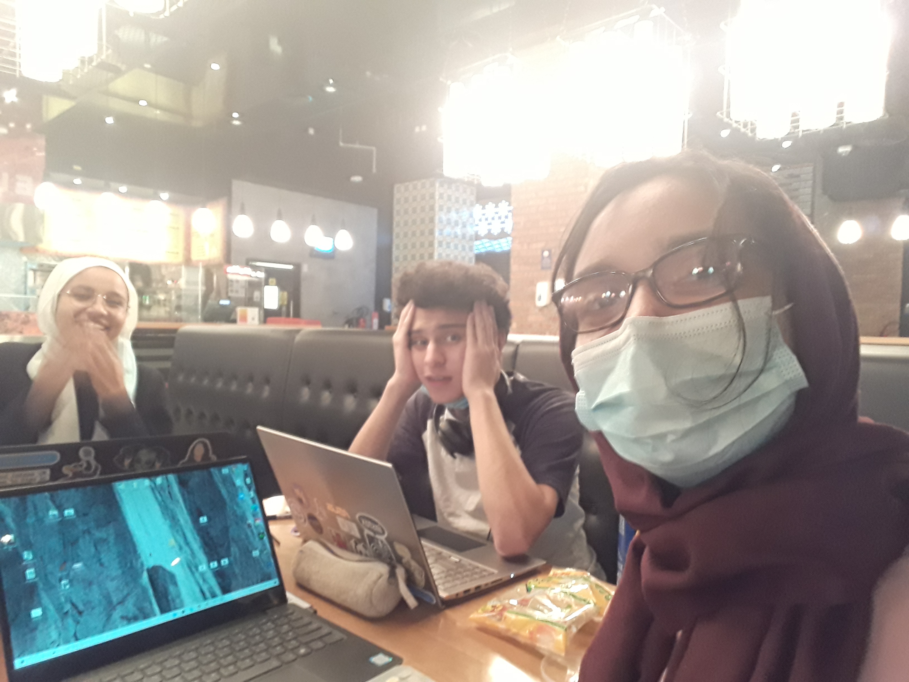

## Documentation

### How to Tie a Tie

### Description
'How to Tie a Tie' is a three-part video series that explores toxic masculinity through the metaphor of tying a tie. The actual procedure of tying the tie is interspersed with a narration/visuals that explore various aspects of supposed "manliness" and its associated social expectations. After each step that explains how to tie the tie, a screen appears prompting the user to repeat the motion that was last shown. 

The experience we strove to create was that of a "sarcastic yet not sarcastic" (in Fatema's words) take on toxic masculinity. We wanted to incorporate as many elements that would hint at a traditional masculine feel: black and white colors, vintage-looking fonts that appear on men's shaving cream logos, and the clean, sharp, straight lines in our layout. Only one female (just her arm) appears throughout the project -- even the photo album is filled with men.

### Process
We started off with a Miro Board, collating the themes, designs, and content we wanted to explore. We then met up at the start of the weekend and created a shot list https://docs.google.com/spreadsheets/d/14eHzcz333rSu6pU55sHsT4P9-IS5VvAmb3i2gaipP5c/edit?usp=sharing. We collected all the required props, met the next day, and filmed all of our required footage. Our  actor for the father figure did not arrive in time, so we adjusted the script to refer to a 'parent figure' instead, and one of us played the mother (= mother's arm). At the end of the shoot, the star of our film, Juan, recorded the voice overs in a state-of-the-art recording studio (a wardrobe) to minimize the echo in the audio. 

We then split the work such that Hanaan worked on the website, Juan worked on the Processing sketch and Fatema worked on editing the footage. As we moved towards wrapping up the project, we worked together on campus - sharing the remaining tasks while getting instant feedback from each other and eating gummy bears. 

### Reflection
Overall, we are incredibly satisfied with our final result. We were able to implement the intended aesthetic with regard to the web layout and the video edits. We are also really pleased with the look and feel of our footage. 
